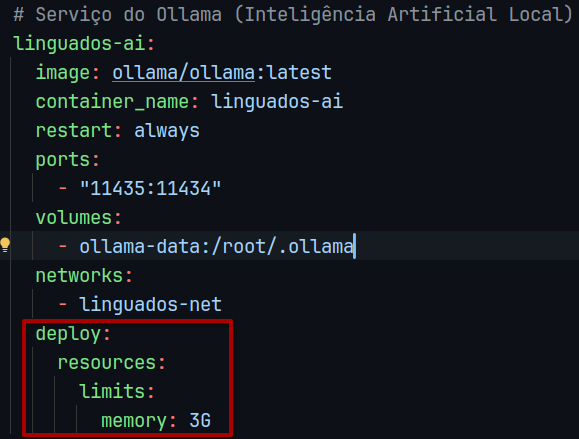

# 🦆 Linguados: Inglês para Desenvolvedores


O **Linguados** é uma plataforma web de inglês instrumental e técnico desenvolvida sob medida para profissionais de TI. Através de maratonas dinâmicas de exercícios práticos, a aplicação une o aprendizado do idioma à fixação de conceitos de engenharia de software, banco de dados e arquitetura de sistemas.

---

## 🛠 Arquitetura e Tecnologias

A aplicação foi desenhada seguindo as boas práticas de baixo acoplamento e separação de responsabilidades.

* **Linguagem:** Java 21 (LTS)
* **Padrão Arquitetural:** MVC (Model-View-Controller) nativo com Servlets e JSPs.
* **Padrão de Persistência:** DAO (Data Access Object) integrado via JDBC puro.
* **Organização de Código:** *Package by Feature* (Módulos isolados por contexto de domínio).
* **Banco de Dados:** MySQL 8.0 / MariaDB (Mapeamento de relacionamentos polimórficos um-para-um).
* **Gerenciador de Build:** Apache Maven
* **Infraestrutura:** Containers Docker orquestrados via Docker Compose.

## 📦 Como Executar

### Pré-requisitos
- [Docker](https://www.docker.com/) e [Docker Compose](https://docs.docker.com/compose/) instalados.

### Passo a Passo

1. **Clone o repositório:**
   ```bash
   git clone https://github.com/linguados-app/linguados-web.git
   cd linguados-web
   ```

2. Suba o ambiente com Docker:
    ```bash
    docker-compose up -d --build
    ```
    
3. Acesse a aplicação em um navegador através do link a seguir:
 - [Linguados - Plataforma Online de Inglês Instrumental](http://localhost:8080/)

4. Para autenticar no sistema:
    ```bash
   # como administrador:
   login: admin@linguados.com
   password: admin123
    ```
    ```bash
   # como estudante:
   login: ian@estudante.com
   password: user123
    ```
Confira o arquivo `initdb/seed.sql` para consultar outras contas disponíveis.


### Problemas ao executar?

Se a execução da IA estiver "travando" seu computador, adicione as seguintes linhas em `docker-compose.yml`:



Isso limita o uso de memória RAM que o serviço utiliza, evitando complicações.

## 📂 Estrutura de Pastas

    linguados-web/
    ├── initdb/                               # Scripts de inicializacao automatica do banco
    │   ├── 01_setup.sql                      # DDL: Estrutura das tabelas e relacionamentos
    │   └── 02_seed.sql                       # DML: Carga massiva de dados e gamificacao
    ├── src/main/java/com/linguados/          # Codigo-fonte Java (Package by Feature)
    │   ├── chat/                             # Motor de comunicacao e WebSockets (Real-time Chat)
    │   ├── config/                           # Infraestrutura de pooling e conexao com MySQL
    │   ├── dashboard/                        # Controlador das metricas e graficos semanais
    │   ├── desafio/                          # Core pedagogico: Modelos polimorficos e Servlets da maratona
    │   ├── modulo/                           # Gerenciamento de trilhas e catalogos de modulos
    │   ├── perfil/                           # Visualizacao de insignias e edicao de dados do usuario
    │   ├── progresso/                        # Persistencia e computacao de XP e logs de conclusao
    │   ├── ranking/                          # Classificacao de estudantes baseada em performance
    │   └── usuario/                          # Autenticacao, niveis, streaks e controle de perfis
    ├── src/main/webapp/                      # Interface Web e Recursos Estaticos
    │   ├── WEB-INF/                          # Diretorio protegido do servidor
    │   │   ├── views/                        # Paginas JSP segmentadas por contexto
    │   │   │   ├── admin/                    # Formularios exclusivos de gerenciamento de conteudo
    │   │   │   ├── chat/                     # Interface do chat global
    │   │   │   ├── desafio/                  # Templates customizados para cada subclasse de exercicio
    │   │   │   ├── modulo/                   # Listagem de trilhas para o estudante
    │   │   │   ├── perfil/                   # Painel tátil de insignias do usuario
    │   │   │   ├── ranking/                  # Tela de classificacao liderada pelos estudantes
    │   │   │   └── usuario/                  # Telas de login, cadastro e portal inicial
    │   │   └── web.xml                       # Descriptor de implantacao e mapeamento do container
    │   └── assets/                           # Arquivos estaticos expostos (CSS, JS, Imagens)
    ├── Dockerfile                            # Instrucoes de build da imagem Tomcat da aplicacao
    ├── docker-compose.yml                    # Orquestracao dos containers (App + Banco MySQL)
    └── pom.xml                               # Configuracoes do ciclo de vida e dependencias do Maven

## Metodologia de Desenvolvimento

Para garantir a organização, rastreabilidade e qualidade do código, o projeto adota um fluxo de trabalho baseado em práticas ágeis e padrões de mercado:

### 📑 Gestão de Tarefas (GitHub Projects)
Utilizamos o **GitHub Projects** com a metodologia **Kanban** para gerenciar o ciclo de vida de cada funcionalidade. As tarefas são divididas em:
- **Backlog:** Ideias e funcionalidades planejadas.
- **Todo:** Tarefas prioritárias para o ciclo atual.
- **In Progress:** Atividades em desenvolvimento.
- **Done:** Funcionalidades testadas e integradas.

### 🌿 Fluxo de Trabalho (Git Flow)
Adotamos uma versão simplificada do **Git Flow** para manter a estabilidade do código:
- `main`: Contém apenas código estável e pronto para produção.
- `dev`: Branch de integração para novas funcionalidades.
- `feature/nome-da-task`: Branches temporárias criadas a partir da `dev` para o desenvolvimento de tarefas específicas.
- **Pull Requests:** Toda alteração deve passar por revisão antes de ser mesclada à branch principal.

### 📐 Modelagem e Documentação (UML)
A arquitetura do sistema é validada antes da codificação através de diagramas **UML**:
- **Diagrama de Classes:** Para estruturar o herança e polimorfismo dos desafios.

<table>
  <thead>
    <tr>
      <th>Diagrama de Classes</th>
    </tr>
  </thead>
  <tbody>
    <tr>
      <td></td>
    </tr>
  </tbody>
</table>

- **Diagrama de Casos de Uso:** Para mapear as interações entre o Estudante/Administrador e o sistema.
- **DER (Diagrama Entidade-Relacionamento):** Para modelagem das tabelas e chaves estrangeiras no MySQL.

### 🦆 Engenharia de Software e Qualidade
- **Rubber Duck Debugging:** Incentivamos a prática de explicar o código linha por linha para identificar falhas lógicas.
- **MVC Pattern:** Separação clara entre dados, interface e lógica de negócio.
- **Conventional Commits:** Mensagens de commit padronizadas (ex: `feat:`, `fix:`, `docs:`) para facilitar a leitura do histórico.

## 🤝 Contribuição

1. Faça um **Fork** do projeto.
2. Crie uma **Branch** para sua funcionalidade (`git checkout -b feature/NovaFuncionalidade`).
3. Faça o **Commit** das suas alterações (`git commit -m 'Add: Nova Funcionalidade'`).
4. Faça o **Push** para a Branch (`git push origin feature/NovaFuncionalidade`).
5. Abra um **Pull Request**.

## 👩‍💻 Contribuidores

<table border="0" cellpadding="0" cellspacing="0">
  <tr>
    <td align="center" valign="top">
      <a href="https://github.com/andreasgunther">
        
        <br />
        <sub><b>Andreas Gunther</b></sub>
      </a>
    </td>
    <td align="center" valign="top">
      <a href="">
        
        <br />
        <sub><b>Rubens Ian</b></sub>
      </a>
    </td>
    <td align="center" valign="top">
      <a href="https://github.com/VitorP2007">
        
        <br />
        <sub><b>Vitor Pizolato</b></sub>
      </a>
    </td>
  </tr>
</table>
